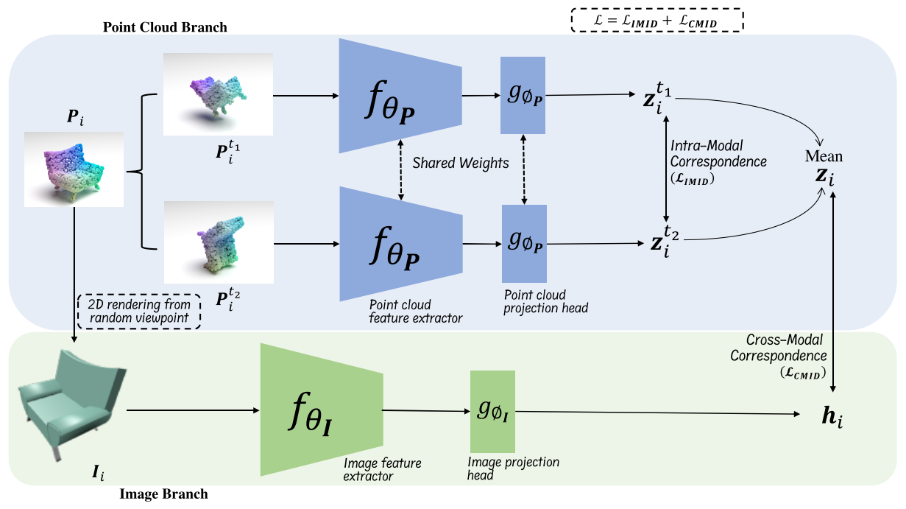

## Introduction
This repository is a PyTorchDistributedDataParallel (DDP) re-implementation of the CVPR 2022 paper [CrossPoint](https://openaccess.thecvf.com/content/CVPR2022/html/Afham_CrossPoint_Self-Supervised_Cross-Modal_Contrastive_Learning_for_3D_Point_Cloud_Understanding_CVPR_2022_paper.html). 

* First, the re-implementation aims to accelerate the process of training and inference by the PyTorch DDP mechanism since
the [original implementation](https://github.com/MohamedAfham/CrossPoint) by the author is for single-GPU learning
and the procedure is much slower, especially when contrastive pre-training on ShapeNetRender. 

* Second, the re-implementation adds necessary comments, removes unused packages, unify the code style, re-organize README, etc. 

    

## Preparation
### Package Setup
* Ubuntu 18.04
* Python 3.7.13
* PyTorch 1.11.0
* CUDA 10.2
* torchvision 0.12.0
* wandb 0.12.11
* pueue & pueued 2.0.4

```shell
  conda create -n crosspoint python=3.7.13
  codna activate crosspoint

  pip install torch==1.11.0+cu102 torchvision==0.12.0+cu102 --extra-index-url https://download.pytorch.org/whl/cu102
  pip install -r requirements.txt
```

`pueue` is a shell command management software, we use it for scheduling the model training & inference tasks, please refer to the [official page](https://github.com/Nukesor/pueue) for installation and basic usage. We recommend this tool because you can run the experiments at scale with its help thus save your time. 

### W&B Server Setup
We track the model training and fine-tuning with W&B tools. The official W&B tools may be slow and unstable since 
they are on remote servers, we install the local version by running the following command. 

```shell
  docker run --rm -d -v wandb:/vol -p 28282:8080 --name wandb-local wandb/local:0.9.41
```

If you do not have Docker installed on your computer before, referring to the [official document](https://docs.docker.com/engine/install/ubuntu/) to finish Docker installation on Ubuntu.

### Pretrained Models
CrossPoint pretrained models with DGCNN feature extractor are available [here.](https://drive.google.com/drive/folders/10TVEIRUBCh3OPulKI4i2whYAcKVdSURn?usp=sharing)

### Datasets
1. Datasets are available [here](https://drive.google.com/drive/folders/1dAH9R3XDV0z69Bz6lBaftmJJyuckbPmR?usp=sharing). Run the command below to download all the datasets (ShapeNetRender, ModelNet40, ScanObjectNN, ShapeNetPart) to reproduce the results.
    ```
    cd data
    source download_data.sh
    ```
2. The directories of the downloaded datasets should be organized as follows
    ```
    |- CrossPoint-DDP
    |---- data
    |-------- ShapeNetRendering
    |-------- modelnet40_ply_hdf5_2048
    |-------- ScanObjectNN
    |-------- shapenet_part_seg_hdf5_data
    ```
    The `data` directory is at the same level with `models`, `scripts`, etc.

## Usage
### Pre-train CrossPoint
  ```shell
  ./scripts/pt-cls.sh
  ./scripts/pt-partseg.sh
  ```

### Downstream Tasks
#### Zero-shot 3D Object Classification
Run `eval_ssl.ipynb` notebook to perform linear SVM object classification in both ModelNet40 and ScanObjectNN datasets.

#### Few-Shot Object Classification
Refer `scripts/fsl_script.sh` to perform few-shot object classification.

#### Finetune CrossPoint on 3D Object Classification
  ```shell
  ./scripts/ft-mn.sh  # finetune on ModelNet40
  ./scripts/ft-so.sh  # finetune on ScanObjectNN
  ```

#### Finetune CrossPoint on 3D Object Part Segmentation
Refer `scripts/script.sh` for fine-tuning experiment for part segmentation in ShapeNetPart dataset.
  ```shell
  ./scripts/ft-partseg.sh
  ```

## Acknowledgements
The re-implementation is partially inspired by the following projects, thanks to their hard work
* [CrossPoint](https://github.com/MohamedAfham/CrossPoint)
* [DGCNN](https://github.com/WangYueFt/dgcnn) 
